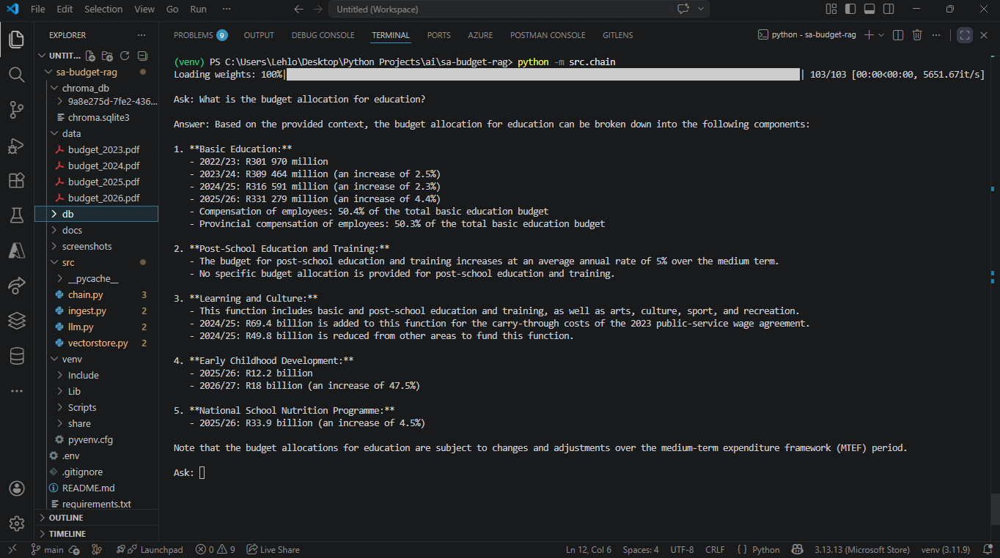
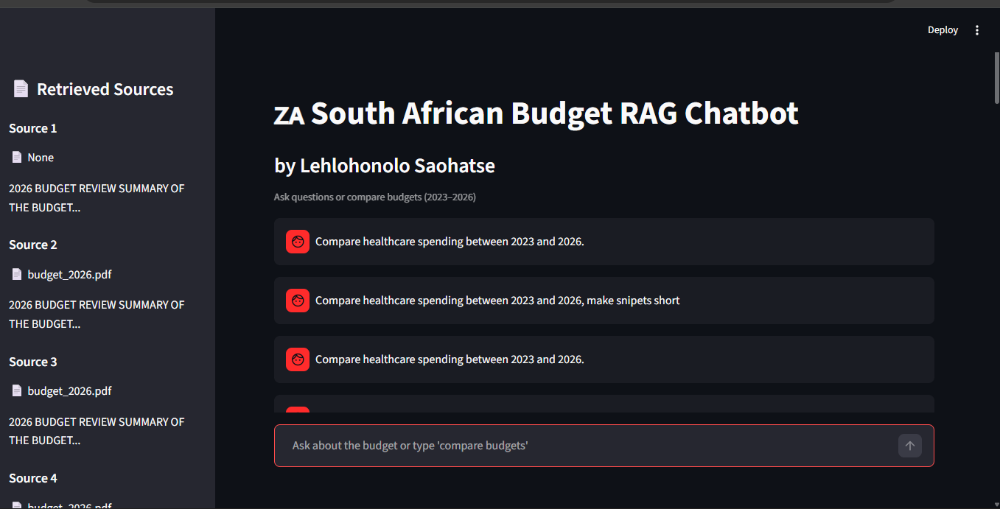
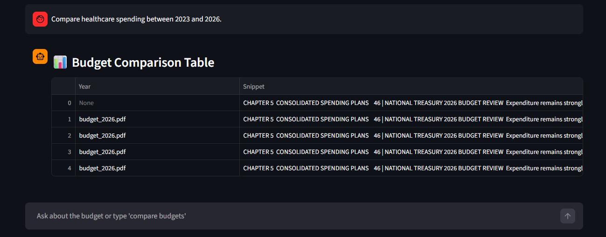
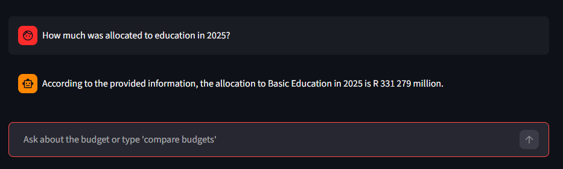
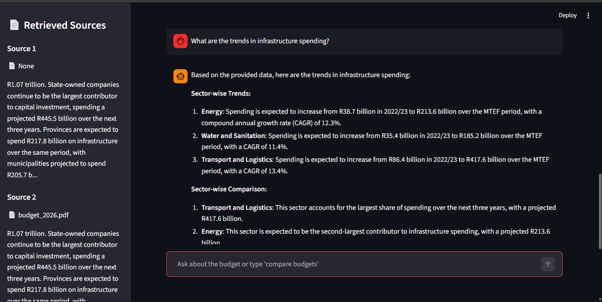
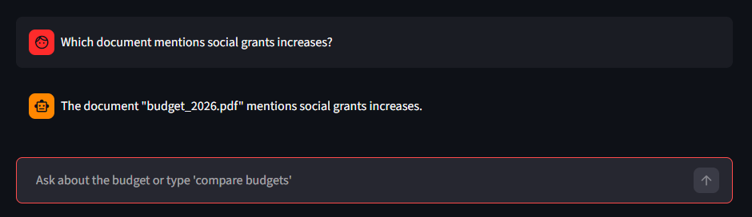
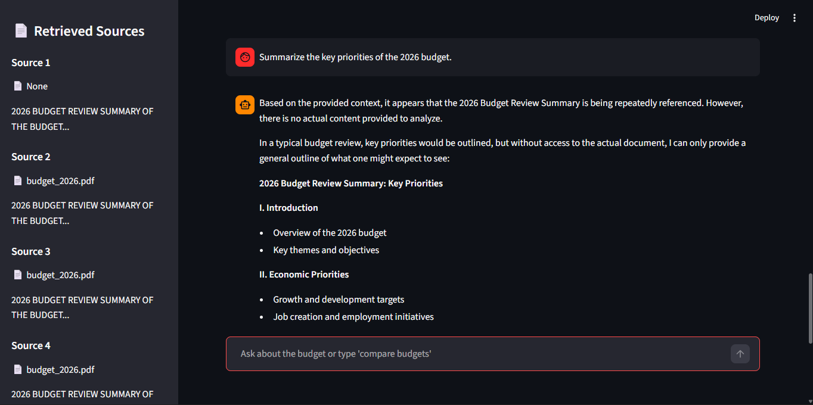

# South African Budget RAG LLM Chatbot

An AI-powered **Retrieval-Augmented Generation (RAG)** chatbot that analyzes and compares South African national budget documents (2023-2026).

Built using modern LLM tooling, this project demonstrates **real-world NLP, semantic search, and multi-document reasoning** using LangChain’s latest architecture.

> It is deployed on Streamlit, you can try it out on: https://sa-budget-rag-llm-chatbot.streamlit.app/

---




---

## 🚀 Features

* 🔍 **Semantic Search (RAG)** over budget PDFs
* 📊 **Multi-Year Budget Comparison (2023–2026)**
* 📚 **Source-Grounded Answers** (with document references)
* ⚡ **Fast Vector Search** using ChromaDB
* 🤖 **LLM-Powered Responses** (Groq / HuggingFace)
* 🌐 **Interactive Web App UI** built with Streamlit
* 🧠 Handles complex queries like:

  * “Compare healthcare spending across years”
  * “What are the priorities of the 2026 budget?”
  * “Which document mentions social grants?”

---

## 🏗️ Architecture

```
User Query
     ↓
Retriever (ChromaDB)
     ↓
Relevant Budget Chunks
     ↓
Prompt Template
     ↓
LLM (Groq / HF)
     ↓
Final Answer (with context)
```


## 📂 Project Structure

```
South-African-Budget-NLP-RAG-Chatbot/
│
├── data/                  # Budget PDFs (2023–2026)
├── screenshots/           # Demo screenshots
│
├── src/
│   ├── app.py             # Streamlit UI
│   ├── chain.py           # RAG pipeline (LCEL)
│   ├── ingest.py          # Document loading & splitting
│   ├── llm.py             # LLM configuration
│   ├── vectorstore.py     # Embeddings + Chroma DB
│
├── requirements.txt
├── .env
└── README.md
```

---

## ⚙️ Installation

### 1. Clone the repo

```bash
git clone https://github.com/Lehlohonolo-Saohatse/SA-Budget-RAG-LLM-Chatbot.git
cd South-African-Budget-NLP-RAG-Chatbot
```

### 2. Create virtual environment

```bash
python -m venv venv
```

### 3. Activate environment

**Windows (PowerShell):**

```bash
venv\Scripts\activate
```

**Mac/Linux:**

```bash
source venv/bin/activate
```

---

### 4. Install dependencies

```bash
pip install -r requirements.txt
```

---

### 5. Set environment variables

Create a `.env` file:

```env
GROQ_API_KEY=your_api_key_here
```

---

## ▶️ Running the App

### Run Streamlit UI

```bash
streamlit run src/app.py
```

---

### Run CLI version

```bash
python -m src.chain
```

---

## 📸 Example Queries & Results

Below are real examples of chatbot outputs using South African budget documents.

---

### 🧠 Budget Comparison

**Prompt:**

> Compare healthcare spending between 2023 and 2026.



---

### 📊 Education Allocation

**Prompt:**

> How much was allocated to education in 2025?



---

### 📈 Spending Trends

**Prompt:**

> What are the trends in infrastructure spending?



---

### 🔍 Source Validation

**Prompt:**

> Which document mentions social grants increases?



---

### 💬 Budget Summary

**Prompt:**

> Summarize the key priorities of the 2026 budget.



---

## 🧠 Key Capabilities

* Retrieval-Augmented Generation (RAG)
* Multi-document reasoning
* Context-aware LLM responses
* Vector embeddings with HuggingFace
* Modular LangChain (LCEL) pipeline
* Real-world financial document analysis

---

## 🛠️ Tech Stack

* Python
* LangChain (Latest LCEL API)
* ChromaDB (Vector Database)
* Sentence Transformers (Embeddings)
* Groq / HuggingFace (LLMs)
* Streamlit (Frontend UI)

---

## ⚠️ Known Issues & Fixes

### ❌ `ModuleNotFoundError: src`

Run using:

```bash
python -m src.chain
```

---

### ❌ `No module named langchain.text_splitter`

Fix:

```bash
pip install langchain-text-splitters
```

---

### ❌ `No module named torchvision`

Fix:

```bash
pip install torchvision
```

---

## 🔮 Future Improvements

* 📊 Add visual charts for budget comparisons
* 📁 Upload custom documents in UI
* 🧠 Memory-enabled conversations
* 🌍 Deploy to cloud (Streamlit Cloud / AWS)
* 🔎 Hybrid search (keyword + semantic)

---

## 📜 License

MIT License
